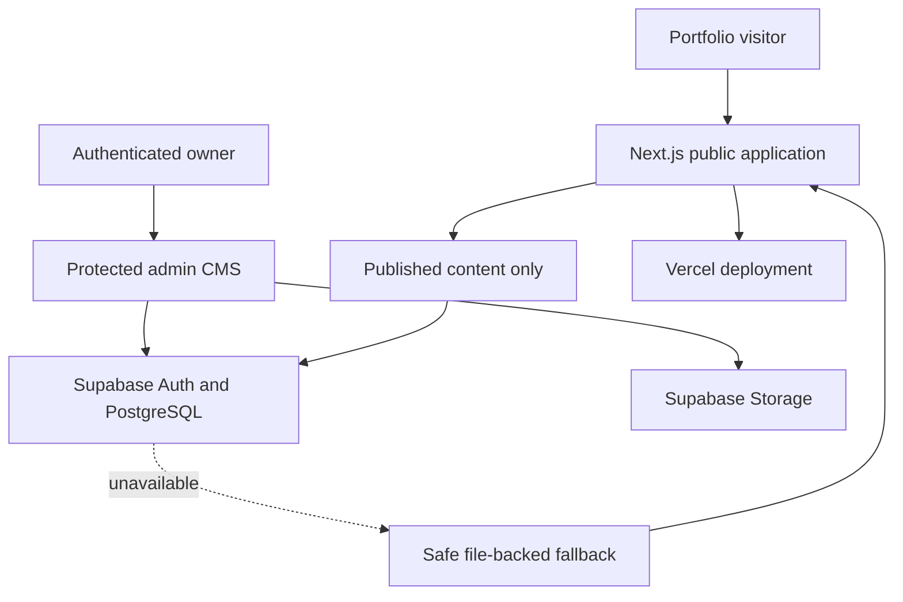

# Barnx Portfolio CMS

A production portfolio and custom content-management system built with Next.js and Supabase. It gives Barnabas Mikel one protected workspace for managing projects, professional positioning, media, impact stories, developer resources, site settings and privacy-conscious analytics.

**Live portfolio:** [barnx-portfolio-v2.vercel.app](https://barnx-portfolio-v2.vercel.app)

## What it proves

- Full-stack application development with Next.js 15, React 19 and TypeScript
- PostgreSQL-backed content modelling and publishing workflows
- Supabase Authentication, Storage and Row-Level Security
- Structured draft/publish workflows with server-side validation
- Public content loaders with safe file-backed fallbacks
- First-party analytics with rate limiting, duplicate suppression and 90-day retention
- Responsive, accessible public and admin interfaces
- Preview-first delivery and automated Vercel deployments

## System architecture



## CMS areas

- Projects and ordered project media
- Professional positioning, capabilities, services and experience
- Impact stories
- Barnx Studio categories, resources, prompts and learning paths
- Media Library with protected uploads and reference-safe deletion
- Public site settings and SEO defaults
- First-party analytics dashboard

The professional-content editor stores private drafts and public published content separately. Public visitors can read only published records; admin mutations require an authenticated CMS owner and server-side validation.

## Main routes

- `/` — public portfolio
- `/projects` and `/projects/[slug]` — project archive and case studies
- `/projects/barnx-portfolio-cms` — architecture and implementation case study
- `/capabilities` and `/experience` — CMS-driven professional content
- `/impact` — evidence-first impact stories
- `/barnx-studio` — developer resources, prompts and learning paths
- `/admin` — protected CMS dashboard
- `/admin/professional` — structured professional-content editor

## Local development

Create `.env.local` from `.env.example` and provide the project’s public Supabase configuration. Never commit service-role keys or account credentials.

```bash
npm install
npm run dev
```

## Verification

```bash
npm run typecheck
npm run validate:schema
npm run build
```

Database migrations are versioned in `supabase/migrations`. Apply them in filename order through the project’s established Supabase deployment process before testing CMS features in a new environment.

## Security foundations

- Row-Level Security on CMS tables and storage policies
- Admin authorization on content mutations
- Public queries limited to published content
- Same-origin and request-size checks for analytics ingestion
- Upload type, size, path and metadata validation
- Security headers and no-store behavior for protected routes

This repository demonstrates security foundations for a portfolio CMS; it is not presented as a general-purpose security product.
